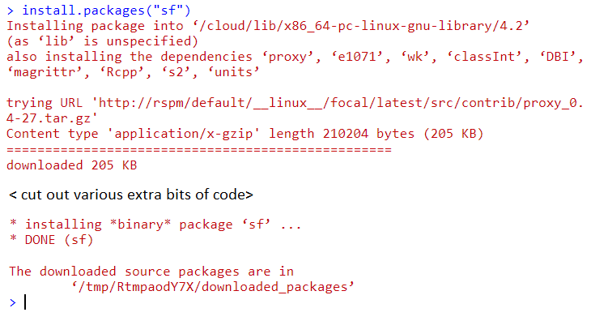
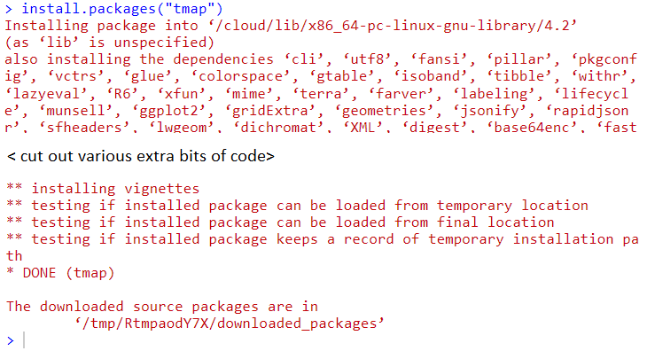
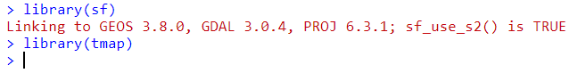
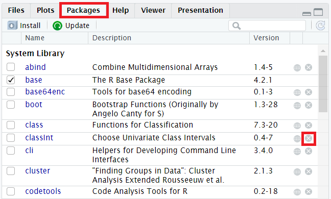

## Installing R & RStudio Libraries - Troubleshooting

Installing Libraries in R can be problematic sometimes. Here are a few hints and tips that might be useful for you.

## Install sf

R uses libraries to add features and different tools, such as GIS and spatial analysis. We need to install some libraries we will be using. Follow these instructions to install the `sf` library. *Note the terms library and package are interchangeable.*

- Open **RStudio**.
- In the **Console** type in `install.packages("sf")` and press enter.

This is (approximately) the output you should get (click the link for the full image):

{ width=70% }

- Check the output you get - red text does not always mean an error!

## Install tmap

- Repeat the process for the `tmap` package.
- In the **Console** type in `install.packages("tmap")`.

This is (approximately) the output you should get (*I've not included the full version because it is so long!*):

{ width=70% }

## Problems

If you don't get this output, there may have been a problem. Best move is to try loading the libraries.

- In the **Console** type in `library(sf)`.
- and then type in `library(tmap)`.

You should get something like this:

If you don't, then there are a few steps you can try:

- R might say a dependent library is unavailable. 
	- Check what the red text says. If it says (for example) `There has been an error installing the Rcpp library`, try installing that library:
	- `install.packages("Rcpp")
	- Then try loading it: `library(Rcpp)`
	- If that works, try installing either `sf` or `tmap` again.
- It might give you instructions to install another piece of software - try this if you can. 
- If neither of those work, you can try uninstalling and reinstalling the library
	- Remove using `remove.packages("classInt")` (*for the `classInt` package) or
	- Open the **Packages** tab (on the right) and click the `X` by whichever package you want to remove:
	
	{ width=70% }
	
- If that doesn't work, do reach out to me before the course and ask for help.

- An alternative is to use [RStudio.cloud](r-rstudio.html#RStudio-Cloud). 

*This work is licensed under the Creative Commons Attribution-ShareAlike 4.0 International License. To view a copy of this license, visit [http://creativecommons.org/licenses/by-sa/4.0/deed.en](http://creativecommons.org/licenses/by-sa/4.0/deed.en). The latest version of this is available from [https://nickbearman.github.io/installing-software/r-rstudio](https://nickbearman.github.io/installing-software/r-rstudio).*
